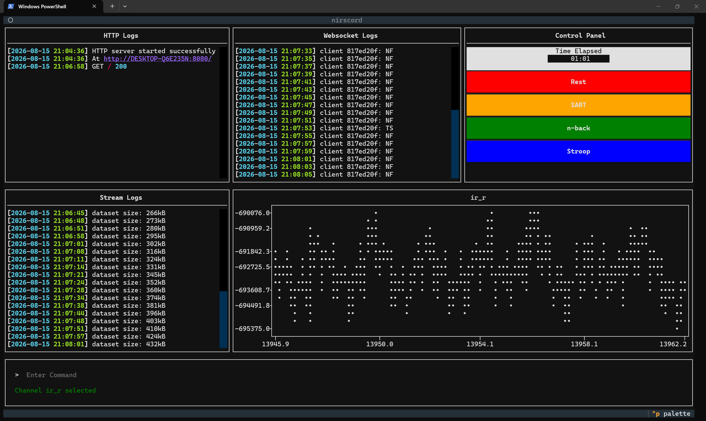

# nirscord

A simple textual app that allows for recording and labelling live fNIRS stream data during experiments.

# Installation

Simply ensure `uv` is available on the command line, clone this repository, and run `uv tool install .`